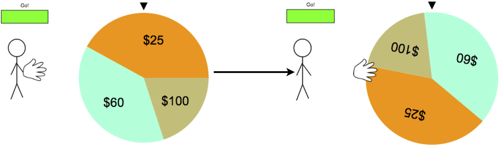

```{r preamble, echo=FALSE, message=FALSE}
setwd("~/Git/cfDistance/")
library(lme4)
library(ggplot2)
source("http://web.stanford.edu/~dco/common/summarySE.R")
source("http://web.stanford.edu/~dco/common/useful.R")
source("http://web.stanford.edu/~dco/common/processData.R")

my_default_theme = theme_bw() + theme(strip.background = element_rect(fill="#FFFFFF"), 
        strip.text = element_text(size=12), 
        axis.text = element_text(size=12),
        axis.title.x = element_text(size=14, vjust=-0.2),
        axis.title.y = element_text(size=14, vjust=0.35),
        legend.text = element_text(size=12),
        title = element_text(size=18, vjust=1),
        panel.grid = element_blank())
```

This markdown document contains code and analyses to accompany the following manuscript.

Ong, D. C., Goodman, N. D., & Zaki, J. (2015). Near-misses sting even when they are uncontrollable. Proceedings of the 37th Annual Meeting of the Cognitive Science Society. 


I have appended the text of the paper, but it is much easier to read in the journal-formatted form.


# Introduction


> "Close only counts in horseshoes and hand grenades" -- English Proverb

Observers typically infer that people feel more positively when they succeed, rather than fail, at attaining desired outcomes (e.g., winning vs. losing a soccer game). Such intuitive reasoning about emotions comprises what we term affective cognition (Ong, Zaki, & Goodman, under review), and forms an integral part of our social lives. Our intuitive theories of emotion, however, are more nuanced than simple considerations of success and failure: If an agent fails to achieve an outcome by a small margin, such as losing a soccer game by a single goal (a near-miss), people often infer that the agent would feel worse than if they had lost by a larger margin. Penalty shootouts in soccer provides the most exaggerated of such near-miss scenarios: the losing team often loses because of a single shot, sometimes an inch shy of escaping the goalkeeper’s hands. In cases like these, contrary to the proverb above, close does count—emotionally.


Psychologists have long examined near-misses (Gleicher et al., 1990; Johnson, 1986; Kahneman & Tversky, 1982; Teigen, 1996), but have yet to factor them systematically into theories of reasoning about emotions (Ong et al., under review). Most of this work examines counterfactual thinking more broadly, or thinking about “what might have been” (Byrne, 2002; McMullen & Markman, 2002; Medvec & Savitsky, 1997; Roese, 1997). On most accounts, near-misses increase counterfactual thinking, because alternate outcomes almost occurred, and thus are easier to imagine.
Many open questions remain regarding the nature of near-miss effects, and how they impact observers’ lay theories of emotion. First, when and why do people infer that a near-miss will "hurt" an agent most? One explanation is that agents experiencing a near-miss could have done something different to achieve the desired outcome, increasing their subsequent experience of regret (e.g., Zeelenberg, van Dijk, Manstead, & der Pligt, 1998). Consider Kahneman and Tversky (1982)’s classic example of Mr. Tees, who missed his plane by 5 minutes, and Mr. Crane, who missed his plane by 30 minutes. People reliably judge Mr. Tees, who narrowly missed his plane, to feel worse than Mr. Crane. Here, Mr. Tees could have left his home slightly earlier in order to catch his plane, and Mr. Tees’ resulting responsibility for his misfortune might drive his near-miss negative affect. Consistent with this idea, the controllability of outcomes affects counter- factual thinking in non-near-miss contexts (Roese & Olson, 1995). If people infer near-misses to be painful because of an agent’s control over their outcomes, then observers should only attribute near-miss-related negative emotion to agents who have such control. By contrast, observers should not rate near-misses as worsening an agent’s emotional state if that agent had no control over the outcome. For instance, an observer who sees an agent miss a randomly determined positive outcome (e.g., a win in roulette instead of soccer) by a small distance should not rate that agent as feeling more negative emotion than an agent who misses by a large distance.

However, emotions may not always adhere to this rule. For instance, gamblers show increased motivation and persisted in gambling more after near-misses, even though the outcomes are random and thus independent of the gambler’s actions (Kassinove & Schare, 2001; Reid, 1986). This behavior may very well be incorporated into observers’ lay theory of emotion. In Experiment 1, we tested the prediction of the controllability account further by examining whether ob- servers incorporate near-misses in judgments of others' emotions even in scenarios with random outcomes. We show that observers readily judge an agent who "narrowly misses" on a task with randomly-generated outcomes (by rolling a number on a die that is close to a target number) as feeling worse than one who misses by a larger amount.

Second, why might observers factor near-misses into affective cognition for random outcomes over which agents clearly have no control? One possibility is that in such situations, observers might irrationally believe that agents do exert some control over their outcomes, or believe that agents believe they do. Such "illusions of control" over random events are, in fact, common: People are more confident that they will win a raffle if they chose their ticket numbers themselves than when they are assigned numbers (Langer, 1975; Taylor & Brown, 1988). If observers do indeed ascribe illusory control to agents, observers should include near-misses into their emotion attributions even in demonstrably random situations.

In Experiment 2, we explored this possibility by manipulating the rules of a game with random outcomes, producing two situations that we believed would induce illusions of control in different ways. In Version A of the game, observers saw an agent guess the location of a single "target" card with a known number ("Guess where the 10 card is") amidst a large array of cards. In Version B, agents had to guess the number behind a target card at a fixed location ("Guess what number is behind this card"). We crossed this manipulation with whether agents' choices were spatially and / or numerically close to / distant from the actual target. In all cases, observers believed that the location (in Version A) or number (in Version B) of the target card was chosen at random, and thus agents had no actual control over their chances of winning. We reasoned that in Version A--when agents chose the locations of their cards--observers might nonetheless ascribe illusory control over whether agents chose the location of the target card1. Hence, observers would be more likely to judge that an agent whose choice was spatially close to, as compared to distant from, the target card would feel worse. By contrast, in Version B--in which agents guessed the number of a fixed location card--observers might imbue that agent with illusory control over guessing the correct number. If this is the case, observers should attribute more negative affect to agents when they are numerically close, versus far, from the target answer. The results of Experiment 2 support this hypothesis of illusory control impacting near-miss judgments.


Finally, how much does a near-miss cost psychologically? That is, what is the size of the near-miss effect relative to the overall effect of an agent’s win or loss on an observer’s attribution about that agent’s emotion? In a meta-analysis, we build upon a previous model of affective cognition (Ong et al., under review). This previous work used a gambling paradigm that allowed us to parametrically vary features of the situation that would impact judgment of emotions. We explicitly incorporate near-miss effects into our existing quantitative model, which allowed us to estimate the extent to which observers believe agents who were close, as compared to far, from desirable outcomes felt negative emotion. We could further compare the effect size of near-misses to those associated with achieving relatively favorable or unfavorable outcomes, thus quantifying near-miss effects and integrating them into a more comprehensive models of affective cognition.

In sum, this paper explored (i) whether people incorporate near-misses in their lay theories of emotion in scenarios with randomly-determined outcomes; (ii) whether people might do so because of illusory control agents may feel over these outcomes; and (iii) how much near-misses "cost," in emotional terms relative to winning and losing.

<hr><br><br>

# Experiment 1: Near-Misses in a random event

In Experiment 1, we tested if participants would incorporate near-miss effects in their judgment of emotions when agents played a luck-based gamble. Importantly, we varied near-misses along numerical closeness, and because the outcomes from rolling dice are completely random, the agent demonstrably had no control over the outcome.

Experiment Link
+ https://cocolab.stanford.edu/cogsci2015/nearmiss/expt1/

#### Participants and Procedures.

We recruited 150 participants through Amazon’s Mechanical Turk (AMT). Participants read about two characters, Jacob and Alex, playing a gambling game. Both needed to roll a 6 on a die to win. Jacob rolled a 1, whereas Alex rolled a 5. Participants then answered attention check questions (“what did X roll?”) before attributing emotions along six categories (happiness, sadness, relief, regret, contentment and disappointment) to each character. Finally, they answered a three-alternative forced choice question: “Who felt worse?”, and were allowed to endorse "They both felt equally bad" as an option. Participants were prompted for a free-response justification for their choice.

```{r expt1data-preamble, echo=FALSE, fig.height=5, fig.width=8.5}
expt1data = read.csv('Data/expt1-data.csv', header=TRUE)

# Grading the attention checks
expt1data$attentionCheck1Correct = (tolower(expt1data$attentionCheck1) == tolower(expt1data$distance1))
expt1data$attentionCheck2Correct = (tolower(expt1data$attentionCheck2) == tolower(expt1data$distance2))
expt1data$attentionCheckWLCorrect = ((expt1data$attentionCheckWL1==expt1data$attentionCheckWL2) & (expt1data$attentionCheckWL1=="L"))

expt1data$use = expt1data$attentionCheck1Correct & expt1data$attentionCheck2Correct & expt1data$attentionCheckWLCorrect
#3 trials failed out of 150
expt1data = expt1data[expt1data$use,]

# forcedWorse: forced choice, which character feels worse? This is "1st" or "2nd" char, but what the char rolled is counterbalanced. (3 == "Both")
# distance1: what the first character rolled
# forcedWorseCollapsed: collapsing across counterbalancing
#   1: char that rolled the 1 feels worse
#   5: char that rolled the 5 feels worse
#   Both: both chars feel just as bad

expt1data$forcedWorse = factor(expt1data$forcedWorse)
expt1data$distance1 = factor(expt1data$distance1, levels=c("1", "5"))

expt1data$forcedWorseCollapsed = factor(
  (   ((expt1data$distance1==1) & (expt1data$forcedWorse==1)) * 1 +
      ((expt1data$distance1==1) & (expt1data$forcedWorse==2)) * 5 +
      ((expt1data$distance1==5) & (expt1data$forcedWorse==1)) * 5 +
      ((expt1data$distance1==5) & (expt1data$forcedWorse==2)) * 1 +
      (expt1data$forcedWorse==3) * 10 ),
  levels = c(1, 5, 10),
  labels = c("1", "5", "Both")
  )


#ggplot(expt1data, aes(x=forcedWorse, fill=distance1)) + geom_histogram(binwidth=.5, origin=0.75, colour="black", position="dodge") + xlab("Who feels Worse?") + facet_grid(trialType ~ ., scales="free_x") + my_default_theme + scale_fill_brewer(palette="Set3") + theme(legend.position="top")

#ggplot(expt1data, aes(x=forcedWorseCollapsed, fill=forcedWorseCollapsed)) + geom_histogram(binwidth=.5, origin=0.75, colour="black", position="dodge") + xlab("Who feels Worse?") + my_default_theme + theme(legend.position = "top")

#table(expt1data$forcedWorseCollapsed)

```


```{r expt1data-analysis1, echo=FALSE, eval=FALSE}
expt1data$FarMissDisapp = expt1data$disapp1*(expt1data$distance1==1) + expt1data$disapp2*(expt1data$distance2==1)
expt1data$NearMissDisapp = expt1data$disapp1*(expt1data$distance1==5) + expt1data$disapp2*(expt1data$distance2==5)
expt1data$FarMissRegret = expt1data$regret1*(expt1data$distance1==1) + expt1data$regret2*(expt1data$distance2==1)
expt1data$NearMissRegret = expt1data$regret1*(expt1data$distance1==5) + expt1data$regret2*(expt1data$distance2==5)
expt1data$FarMissSad = expt1data$sad1*(expt1data$distance1==1) + expt1data$sad2*(expt1data$distance2==1)
expt1data$NearMissSad = expt1data$sad1*(expt1data$distance1==5) + expt1data$sad2*(expt1data$distance2==5)
die_disapp_ttest = t.test(expt1data$NearMissDisapp, expt1data$FarMissDisapp, paired=T)
die_regret_ttest = t.test(expt1data$NearMissRegret, expt1data$FarMissRegret, paired=T)
die_sad_ttest = t.test(expt1data$NearMissSad, expt1data$FarMissSad, paired=T)

die_disapp_ttest  # the only one that's significant.
#die_regret_ttest
#die_sad_ttest

expt1data$FarMissHappy = expt1data$happy1*(expt1data$distance1==1) + expt1data$happy2*(expt1data$distance2==1)
expt1data$NearMissHappy = expt1data$happy1*(expt1data$distance1==5) + expt1data$happy2*(expt1data$distance2==5)
expt1data$FarMissRelief = expt1data$relief1*(expt1data$distance1==1) + expt1data$relief2*(expt1data$distance2==1)
expt1data$NearMissRelief = expt1data$relief1*(expt1data$distance1==5) + expt1data$relief2*(expt1data$distance2==5)
expt1data$FarMissContent = expt1data$content1*(expt1data$distance1==1) + expt1data$content2*(expt1data$distance2==1)
expt1data$NearMissContent = expt1data$content1*(expt1data$distance1==5) + expt1data$content2*(expt1data$distance2==5)
die_happy_ttest = t.test(expt1data$NearMissHappy, expt1data$FarMissHappy, paired=T)
die_relief_ttest = t.test(expt1data$NearMissRelief, expt1data$FarMissRelief, paired=T)
die_content_ttest = t.test(expt1data$NearMissContent, expt1data$FarMissContent, paired=T)

#die_happy_ttest
#die_relief_ttest
#die_content_ttest
```

```{r expt1data-bootstrap, echo=FALSE, eval=FALSE}
#binom.test(30,40,(1/2),alternative="two.sided")
#bootstrap analysis:
bootVec = data.frame(count1 = rep(-1,10000),
                     count5 = rep(-1,10000))
for(j in 1:10000) {
  expt1_boot = sample(expt1data$forcedWorseCollapsed, nrow(expt1data), replace = TRUE, prob = NULL)
  bootVec$count1[j] = sum(expt1_boot=="1")
  bootVec$count5[j] = sum(expt1_boot=="5")
}
bootVec$NM = bootVec$count5 > bootVec$count1
table(bootVec$NM)

#binom.test(30,40,(1/2),alternative="two.sided")
```


#### Results.
Three participants were excluded for failing the attention check. Participants rated the near-miss character (the character who rolled the 5) as feeling significantly more dis- appointed (t(146) = 2.17, p = 0.03), but no different on the other emotions. In the forced-choice question, a large majority (107/147 = 73%) rated both characters as feeling equally bad. Among the remaining participants, significantly more participants rated the character who rolled the 5 (the near-miss character) as feeling worse (N=30) compared to the character who rolled a 1 (N=10; bootstrapped simulation with 10,000 iterations on full sample, p = 0.0007) (See Fig. 1.)


```{r expt1data-plot, echo=FALSE, fig.height=3, fig.width=6}
# Make a plot of the results
expt1data_countsDF = data.frame(response = factor(c("1", "5", "Equal"), levels = c("1", "5", "Equal")),
                              count = c(10, 30, 107), n = c(rep(147,3)))
expt1data_countsDF$proportion = expt1data_countsDF$count / expt1data_countsDF$n
expt1data_countsDF$variance = expt1data_countsDF$proportion * (1-expt1data_countsDF$proportion)
expt1data_countsDF$se = sqrt(expt1data_countsDF$variance/expt1data_countsDF$n)
expt1data_countsDF$ci = 1.96*expt1data_countsDF$se + (0.5/expt1data_countsDF$n)

ggplot(expt1data_countsDF, aes(x=response, y=proportion, fill=response)) + 
  geom_bar(stat="identity", position=position_dodge(), colour="black") +
  geom_errorbar(aes(ymin=proportion-se, ymax=proportion+se), size=.3, width=.2, position=position_dodge(.9)) + 
  xlab("Who feels Worse?") + ylab("Proportion") + my_default_theme + theme(legend.position = "none")

#saved as 6 by 3
```

Figure 1: Expt 1 Results. Proportions of forced choice response. Error bars indicate standard errors. The goal was to roll a “6”. More people judged the character who rolled a “5” as feeling worse than the character who rolled a “1”.


Next, we coded participants' free-response justifications into three categories. 84 (57%) participants made judgments based on equal outcomes ("they both lost so they should feel equally bad"), 40 (27%) participants made reference to closeness ("he was soooo close"), and only 22 (15%) participants made an explicit reference to there being no closeness differences (“it’s a 1/6 chance for both of them”; “the numbers are meaningless”). One participant did not give a justification.

```{r expt1data-analysis, echo=FALSE}

expt1data_freeResponsesDF = data.frame(response = factor(c("Equal Outcomes", "Closeness", "No Closeness", "NA"), levels = c("Equal Outcomes", "Closeness", "No Closeness", "NA")),
                              count = c(84, 40, 22, 1), n = c(rep(147,4)))
expt1data_freeResponsesDF$proportion = expt1data_freeResponsesDF$count / expt1data_freeResponsesDF$n
expt1data_freeResponsesDF$proportion2sf = round(expt1data_freeResponsesDF$proportion, digits=2)
expt1data_freeResponsesDF$label <- paste(expt1data_freeResponsesDF$count,paste("(",expt1data_freeResponsesDF$proportion2sf,"%)",sep=""),sep=" ")
ggplot(expt1data_freeResponsesDF, aes(x=response, y=proportion, fill=response)) + 
  geom_bar(stat="identity", position=position_dodge(), colour="black") + scale_fill_brewer(palette="Set2") +
  geom_text(aes(label=label), vjust=-0.5) + ylim(c(0, 0.6)) +
  xlab("Free Response Justification") + ylab("Proportion") + my_default_theme + theme(legend.position = "none")
# 6 by 4

#table(expt1data$forcedWorseCollapsed, expt1data$trialType)

```


Thus, we find that whereas a large majority of participants said that both characters felt equally bad, this is primarily due to the fact that both characters lost. This suggests that near-miss effects on emotion attribution are smaller in magnitude than those associated with winning or losing in general, though they contribute a significant additional influence. Thus, the results provide evidence that observers are sensitive to near-miss effects in this scenario and they (irrationally) judge near-misses based on a randomly-determined distance that the agent has no control over.

<hr>
<br>
<br>

# Experiment 2: Manipulating illusory control over random events

We designed Experiment 2 to manipulate the illusion of control that agents have over different dimensions in a random game. Using a card guessing task, we manipulated the dimension (spatial position or numbers) along which agents made guesses in a random task, as well as the spatial or numerical distance by which they missed the desired outcome.

Experiment Links
+ https://cocolab.stanford.edu/cogsci2015/nearmiss/expt2/Position
+ https://cocolab.stanford.edu/cogsci2015/nearmiss/expt2/Number

#### Participants. 
We recruited 200 participants through AMT, and assigned them to either a Choose-Position (N=100) or Choose-Number (N=100) condition.


#### Procedures. 
In the *Choose-Position* condition, participants saw a 5x4 array of cards face down. They were told that two characters were playing a game: the cards were numbered 1-20, and the characters had to pick the card with the number 10 to win. There were three types of trials, which were all between subject manipulations, and each participant only saw one trial. In the “Close Distance vs. Close Number” trial (depicted in Fig. 2), participants were told of two characters, Scott, who picked a card with 19 on it (**Close Distance**), and Frank, who picked a card with 11 on it (**Close Num ber**). After the characters picked their cards, the winning number 10 was revealed. Participants saw the locations of the two cards the characters chose, as well as the winning card. The **close distance** character's card was only 1 card away (in physical distance) from the winning card but it was far in numerical distance, whereas the **close number** character’s card had a number that was only 1 away (in numerosity) from the winning card, but far in physical distance. Participants then rated the emotions of the two characters they saw (along the same six emotions as Experiment 1), and rated how close the characters came to winning. Finally, participants answered a forced-choice question, “Who felt worse?”, with a possible option “Both felt equally bad.”


For comparison, we included two other trials with a character who was far on both distance and numerosity. In the “Close Distance vs. Far Both” comparison, participants saw Scott (who picked the 19 card) and David, who picked a card with 1 on it, which is far along both physical distance and numerosity. In this case, David’s card is 9 numbers away from the winning card, which is the same numerical distance as Scott’s card. In the “Close Number vs. Far Both” com- parison, participants saw Frank (who picked the 11 card) and David. In this case, David’s card is just as far in physical distance from the winning card as Frank’s card.

In the *Choose-Number* condition, participants were presented with a game with slightly different rules. There were the same 20 cards, and a target card (circled in purple), all face-down. Characters had to guess the number behind the target card. After picking a number, the card with the picked number was revealed. The characters were the same as in the Position condition, i.e., on “Close Distance vs. Close Number” trials, Scott picked the number 19 (**Close distance**) and Frank picked 11 (**Close Number**). After the character made their guesses, the winning number behind the target card is revealed to be 10. Similar to the *Position* condition, the **close distance** character’s card was close in physical distance, but far in numerical distance; whereas the **close number** character’s card was close in numerical distance, but far in physi- cal distance. Participants then attributed emotions to the two characters, and made a forced-choice judgment about who felt worse. There were similar “Close Distance vs. Far Both” and “Close Number vs. Far Both” trials.


Figure 2: Expt 2 Paradigm, *Position* condition. Characters’ goal is to pick the card with 10 on it. In the “Close Distance vs. Close Number” trial, one character picks the card with 19 on it, outlined in red (Close in physical Distance, far in number), and another character picks the card with 11 on it, outlined in green (Close in Number, far in physical distance). The target card is then revealed, outlined in purple. In other trials, one of the characters picks 1 (indicated in blue; Far in Both physical distance and number).

#### Predictions. 

To reiterate, in the *Position* condition, the number of the goal was known (10) whereas the position was unknown – characters picked a position and were assigned a number (based on their choice). In the *Number* condition, the position of the goal was known, but the number was unknown – characters picked a number and were assigned a position. The two conditions differed in which dimension (position or number) the characters had control over. Importantly, the games were still random events, and the agents’ control is merely illusory. For example, consider the *Position* con dition. One can imagine a possible counterfactual statement generated by Scott, the close distance character: “if only I had chosen the card one position down”. However, if the games were truly random, his re-picking a different card position would still have given him the same 1/20 chance of winning.

Our predictions are summarized in Table 1. In the *Position* condition, the characters chose the physical position of a card, and we predicted that near-misses along physical closeness would be weighted more than near-misses along numerical closeness. In other words, the close distance character would be judged to feel the worst, then the close number character, then the far character. On the other hand, in the *Number* condition, the characters chose the number, and so we predicted that near-misses along numerical closeness would be weighted more than near-misses along physical closeness: the close number character would be judged to feel the worst, then the close distance character, then the far character.

```{r expt2_position_data-preamble, echo=FALSE, fig.height=5, fig.width=8.5}
#b is position
expt2_position_data = read.csv('data/expt2-position-data.csv', header=TRUE)

#attention check
expt2_position_data$attentionCheck1correct = expt2_position_data$attentionCheck1 == expt2_position_data$distance1
expt2_position_data$attentionCheck2correct = expt2_position_data$attentionCheck2 == expt2_position_data$distance2

expt2_position_data$use = expt2_position_data$attentionCheck1correct & expt2_position_data$attentionCheck2correct
expt2_position_data = expt2_position_data[expt2_position_data$use,]

expt2_position_data$distance1 = factor(expt2_position_data$distance1)

# ggplot(expt2_position_data, aes(x=forcedWorse, fill=distance1)) + geom_histogram(binwidth=.5, origin=0.75, colour="black", position="dodge") + xlab("Who feels Worse?") + facet_grid(trialType ~ order) + my_default_theme


expt2_position_data$trialType = factor(expt2_position_data$trialType, levels = c(1,2,3), labels = c("Proximal vs. Numerical", "Proximal vs. Far", "Numerical vs. Far"))

expt2_position_data$worse = factor(
  ( ((expt2_position_data$trialType==1) & (expt2_position_data$distance1==11) & (expt2_position_data$forcedWorse==1)) * 11 +
      ((expt2_position_data$trialType==1) & (expt2_position_data$distance1==11) & (expt2_position_data$forcedWorse==2)) * 19 +
      ((expt2_position_data$trialType==1) & (expt2_position_data$distance1==19) & (expt2_position_data$forcedWorse==1)) * 19 +
      ((expt2_position_data$trialType==1) & (expt2_position_data$distance1==19) & (expt2_position_data$forcedWorse==2)) * 11 +
      ((expt2_position_data$trialType==2) & (expt2_position_data$distance1==1) & (expt2_position_data$forcedWorse==1)) * 1 +
      ((expt2_position_data$trialType==2) & (expt2_position_data$distance1==1) & (expt2_position_data$forcedWorse==2)) * 19 +
      ((expt2_position_data$trialType==2) & (expt2_position_data$distance1==19) & (expt2_position_data$forcedWorse==1)) * 19 +
      ((expt2_position_data$trialType==2) & (expt2_position_data$distance1==19) & (expt2_position_data$forcedWorse==2)) * 1 +
      ((expt2_position_data$trialType==3) & (expt2_position_data$distance1==11) & (expt2_position_data$forcedWorse==1)) * 11 +
      ((expt2_position_data$trialType==3) & (expt2_position_data$distance1==11) & (expt2_position_data$forcedWorse==2)) * 1 +
      ((expt2_position_data$trialType==3) & (expt2_position_data$distance1==1) & (expt2_position_data$forcedWorse==1)) * 1 +
      ((expt2_position_data$trialType==3) & (expt2_position_data$distance1==1) & (expt2_position_data$forcedWorse==2)) * 11 +
      (expt2_position_data$forcedWorse==3) * -1 ),
  levels = c(19, 11, 1, -1),
  labels = c("Proximal", "Numerical", "Far", "Both")
  )


# ggplot(expt2_position_data, aes(x=worse, fill=worse)) + geom_histogram(binwidth=.5, origin=0.75, colour="black", position="dodge") + xlab("Who feels Worse?") + facet_grid( ~ trialType, scales = "free_x") + my_default_theme + theme(legend.position = "top")


#table(expt2_position_data$worse, expt2_position_data$trialType)

expt2_position_data_countsDF = data.frame(trialType = factor(c(rep("Proximal vs. Numerical", 3),rep("Proximal vs. Far",3),rep("Numerical vs. Far",3)),
                                                 levels = c("Proximal vs. Numerical", "Proximal vs. Far", "Numerical vs. Far")),
                              response = factor(c("Proximal", "Numerical", "Both",
                                                  "Proximal", "Far", "Both",
                                                  "Numerical", "Far", "Both"), 
                                                levels = c("Proximal", "Numerical", "Far", "Both")),
                              count = c(14, 5, 15,
                                        9, 1, 11,
                                        9, 2, 31),
                              n = c(rep(34,3),rep(21,3),rep(42,3)))
expt2_position_data_countsDF$proportion = expt2_position_data_countsDF$count / expt2_position_data_countsDF$n
expt2_position_data_countsDF$variance = expt2_position_data_countsDF$proportion * (1-expt2_position_data_countsDF$proportion)
expt2_position_data_countsDF$se = sqrt(expt2_position_data_countsDF$variance/expt2_position_data_countsDF$n)
expt2_position_data_countsDF$ci = 1.96*expt2_position_data_countsDF$se + (0.5/expt2_position_data_countsDF$n)

#http://onlinestatbook.com/2/estimation/proportion_ci.html


#ggplot(expt2_position_data_countsDF, aes(x=response, y=proportion, fill=response)) + 
#  geom_bar(stat="identity", position=position_dodge(), colour="black") +
#  geom_errorbar(aes(ymin=proportion-se, ymax=proportion+se), size=.3, width=.2, position=position_dodge(.9)) + 
#  xlab("Who feels Worse?") + facet_grid( ~ trialType, scales = "free_x") + my_default_theme + theme(legend.position #= "top", axis.text.x = element_text(size=11))

```

```{r expt2_number_data-preamble, echo=FALSE, fig.height=5, fig.width=8.5}
expt2_number_data = read.csv('data/expt2-number-data.csv', header=TRUE)
expt2_number_data$attentionCheck1correct = expt2_number_data$attentionCheck1==expt2_number_data$distance1
expt2_number_data$attentionCheck2correct = expt2_number_data$attentionCheck2==expt2_number_data$distance2

expt2_number_data$use = expt2_number_data$attentionCheck1correct & expt2_number_data$attentionCheck2correct
expt2_number_data = expt2_number_data[expt2_number_data$use,]

expt2_number_data$distance1 = factor(expt2_number_data$distance1)

# ggplot(expt2_number_data, aes(x=forcedWorse, fill=distance1)) + geom_histogram(binwidth=.5, origin=0.75, colour="black", position="dodge") + xlab("Who feels Worse?") + facet_grid(trialType ~ order) + my_default_theme

expt2_number_data$trialType = factor(expt2_number_data$trialType, levels = c(1,2,3), labels = c("Proximal vs. Numerical", "Proximal vs. Far", "Numerical vs. Far"))

expt2_number_data$worse = factor(
  ( ((expt2_number_data$trialType==1) & (expt2_number_data$distance1==11) & (expt2_number_data$forcedWorse==1)) * 11 +
      ((expt2_number_data$trialType==1) & (expt2_number_data$distance1==11) & (expt2_number_data$forcedWorse==2)) * 19 +
      ((expt2_number_data$trialType==1) & (expt2_number_data$distance1==19) & (expt2_number_data$forcedWorse==1)) * 19 +
      ((expt2_number_data$trialType==1) & (expt2_number_data$distance1==19) & (expt2_number_data$forcedWorse==2)) * 11 +
      ((expt2_number_data$trialType==2) & (expt2_number_data$distance1==1) & (expt2_number_data$forcedWorse==1)) * 1 +
      ((expt2_number_data$trialType==2) & (expt2_number_data$distance1==1) & (expt2_number_data$forcedWorse==2)) * 19 +
      ((expt2_number_data$trialType==2) & (expt2_number_data$distance1==19) & (expt2_number_data$forcedWorse==1)) * 19 +
      ((expt2_number_data$trialType==2) & (expt2_number_data$distance1==19) & (expt2_number_data$forcedWorse==2)) * 1 +
      ((expt2_number_data$trialType==3) & (expt2_number_data$distance1==11) & (expt2_number_data$forcedWorse==1)) * 11 +
      ((expt2_number_data$trialType==3) & (expt2_number_data$distance1==11) & (expt2_number_data$forcedWorse==2)) * 1 +
      ((expt2_number_data$trialType==3) & (expt2_number_data$distance1==1) & (expt2_number_data$forcedWorse==1)) * 1 +
      ((expt2_number_data$trialType==3) & (expt2_number_data$distance1==1) & (expt2_number_data$forcedWorse==2)) * 11 +
      (expt2_number_data$forcedWorse==3) * -1 ),
  levels = c(19, 11, 1, -1),
  labels = c("Proximal", "Numerical", "Far", "Both")
  )


# ggplot(expt2_number_data, aes(x=worse, fill=worse)) + geom_histogram(binwidth=.5, origin=0.75, colour="black", position="dodge") + xlab("Who feels Worse?") + facet_grid( ~ trialType, scales = "free_x") + my_default_theme + theme(legend.position = "top")


#table(expt2_number_data$worse, expt2_number_data$trialType)

expt2_number_data_countsDF = data.frame(trialType = factor(c(rep("Proximal vs. Numerical", 3),rep("Proximal vs. Far",3),rep("Numerical vs. Far",3)),
                                                 levels = c("Proximal vs. Numerical", "Proximal vs. Far", "Numerical vs. Far")),
                              response = factor(c("Proximal", "Numerical", "Both",
                                                  "Proximal", "Far", "Both",
                                                  "Numerical", "Far", "Both"), 
                                                levels = c("Proximal", "Numerical", "Far", "Both")),
                              count = c(2, 11, 10,
                                        5, 2, 20,
                                        26, 1, 17),
                              n = c(rep(23,3),rep(27,3),rep(44,3)))
expt2_number_data_countsDF$proportion = expt2_number_data_countsDF$count / expt2_number_data_countsDF$n
expt2_number_data_countsDF$variance = expt2_number_data_countsDF$proportion * (1-expt2_number_data_countsDF$proportion)
expt2_number_data_countsDF$se = sqrt(expt2_number_data_countsDF$variance/expt2_number_data_countsDF$n)
expt2_number_data_countsDF$ci = 1.96*expt2_number_data_countsDF$se + (0.5/expt2_number_data_countsDF$n)

#http://onlinestatbook.com/2/estimation/proportion_ci.html


#ggplot(expt2_number_data_countsDF, aes(x=response, y=proportion, fill=response)) + 
#  geom_bar(stat="identity", position=position_dodge(), colour="black") +
#  geom_errorbar(aes(ymin=proportion-se, ymax=proportion+se), size=.3, width=.2, position=position_dodge(.9)) + 
#  xlab("Who feels Worse?") + facet_grid( ~ trialType, scales = "free_x") + my_default_theme + theme(legend.position #= "top", axis.text.x = element_text(size=11))

```


```{r expt2-individual-emotion-analysis, eval=FALSE, echo=FALSE}
#expt2_position_data
#expt2_number_data


###### 
#proximal vs. numerical
NM_comparison = subset(expt2_position_data, expt2_position_data$trialType=="Proximal vs. Numerical") 
NM_comparison = subset(expt2_number_data, expt2_number_data$trialType=="Proximal vs. Numerical") 
# Choose one of the above

NM_comparison$FarMissDisapp = NM_comparison$disapp1*(NM_comparison$distance1==19) + NM_comparison$disapp2*(NM_comparison$distance2==19)
NM_comparison$NearMissDisapp = NM_comparison$disapp1*(NM_comparison$distance1==11) + NM_comparison$disapp2*(NM_comparison$distance2==11)
NM_comparison$FarMissRegret = NM_comparison$regret1*(NM_comparison$distance1==19) + NM_comparison$regret2*(NM_comparison$distance2==19)
NM_comparison$NearMissRegret = NM_comparison$regret1*(NM_comparison$distance1==11) + NM_comparison$regret2*(NM_comparison$distance2==11)
NM_comparison$FarMissSad = NM_comparison$sad1*(NM_comparison$distance1==19) + NM_comparison$sad2*(NM_comparison$distance2==19)
NM_comparison$NearMissSad = NM_comparison$sad1*(NM_comparison$distance1==11) + NM_comparison$sad2*(NM_comparison$distance2==11)
NM_disapp_ttest = t.test(NM_comparison$NearMissDisapp, NM_comparison$FarMissDisapp, paired=T)
NM_regret_ttest = t.test(NM_comparison$NearMissRegret, NM_comparison$FarMissRegret, paired=T)
NM_sad_ttest = t.test(NM_comparison$NearMissSad, NM_comparison$FarMissSad, paired=T)

NM_disapp_ttest
NM_regret_ttest
NM_sad_ttest

NM_comparison$FarMissHappy = NM_comparison$happy1*(NM_comparison$distance1==19) + NM_comparison$happy2*(NM_comparison$distance2==19)
NM_comparison$NearMissHappy = NM_comparison$happy1*(NM_comparison$distance1==11) + NM_comparison$happy2*(NM_comparison$distance2==11)
NM_comparison$FarMissRelief = NM_comparison$relief1*(NM_comparison$distance1==19) + NM_comparison$relief2*(NM_comparison$distance2==19)
NM_comparison$NearMissRelief = NM_comparison$relief1*(NM_comparison$distance1==11) + NM_comparison$relief2*(NM_comparison$distance2==11)
NM_comparison$FarMissContent = NM_comparison$content1*(NM_comparison$distance1==19) + NM_comparison$content2*(NM_comparison$distance2==19)
NM_comparison$NearMissContent = NM_comparison$content1*(NM_comparison$distance1==11) + NM_comparison$content2*(NM_comparison$distance2==11)
NM_happy_ttest = t.test(NM_comparison$NearMissHappy, NM_comparison$FarMissHappy, paired=T)
NM_relief_ttest = t.test(NM_comparison$NearMissRelief, NM_comparison$FarMissRelief, paired=T)
NM_content_ttest = t.test(NM_comparison$NearMissContent, NM_comparison$FarMissContent, paired=T)

NM_happy_ttest
NM_relief_ttest
NM_content_ttest

NM_comparison$FarMissCloseness = NM_comparison$closeness1*(NM_comparison$distance1==19) + NM_comparison$closeness2*(NM_comparison$distance2==19)
NM_comparison$NearMissCloseness = NM_comparison$closeness1*(NM_comparison$distance1==11) + NM_comparison$closeness2*(NM_comparison$distance2==11)
NM_closeness_ttest = t.test(NM_comparison$NearMissCloseness, NM_comparison$FarMissCloseness, paired=T)

NM_closeness_ttest

###### 
#proximal vs. far
NM_comparison = subset(expt2_position_data, expt2_position_data$trialType=="Proximal vs. Far") 
NM_comparison = subset(expt2_number_data, expt2_number_data$trialType=="Proximal vs. Far") 

NM_comparison$FarMissDisapp = NM_comparison$disapp1*(NM_comparison$distance1==1) + NM_comparison$disapp2*(NM_comparison$distance2==1)
NM_comparison$NearMissDisapp = NM_comparison$disapp1*(NM_comparison$distance1==19) + NM_comparison$disapp2*(NM_comparison$distance2==19)
NM_comparison$FarMissRegret = NM_comparison$regret1*(NM_comparison$distance1==1) + NM_comparison$regret2*(NM_comparison$distance2==1)
NM_comparison$NearMissRegret = NM_comparison$regret1*(NM_comparison$distance1==19) + NM_comparison$regret2*(NM_comparison$distance2==19)
NM_comparison$FarMissSad = NM_comparison$sad1*(NM_comparison$distance1==1) + NM_comparison$sad2*(NM_comparison$distance2==1)
NM_comparison$NearMissSad = NM_comparison$sad1*(NM_comparison$distance1==19) + NM_comparison$sad2*(NM_comparison$distance2==19)
NM_disapp_ttest = t.test(NM_comparison$NearMissDisapp, NM_comparison$FarMissDisapp, paired=T)
NM_regret_ttest = t.test(NM_comparison$NearMissRegret, NM_comparison$FarMissRegret, paired=T)
NM_sad_ttest = t.test(NM_comparison$NearMissSad, NM_comparison$FarMissSad, paired=T)

NM_disapp_ttest
NM_regret_ttest
NM_sad_ttest

NM_comparison$FarMissHappy = NM_comparison$happy1*(NM_comparison$distance1==1) + NM_comparison$happy2*(NM_comparison$distance2==1)
NM_comparison$NearMissHappy = NM_comparison$happy1*(NM_comparison$distance1==19) + NM_comparison$happy2*(NM_comparison$distance2==19)
NM_comparison$FarMissRelief = NM_comparison$relief1*(NM_comparison$distance1==1) + NM_comparison$relief2*(NM_comparison$distance2==1)
NM_comparison$NearMissRelief = NM_comparison$relief1*(NM_comparison$distance1==19) + NM_comparison$relief2*(NM_comparison$distance2==19)
NM_comparison$FarMissContent = NM_comparison$content1*(NM_comparison$distance1==1) + NM_comparison$content2*(NM_comparison$distance2==1)
NM_comparison$NearMissContent = NM_comparison$content1*(NM_comparison$distance1==19) + NM_comparison$content2*(NM_comparison$distance2==19)
NM_happy_ttest = t.test(NM_comparison$NearMissHappy, NM_comparison$FarMissHappy, paired=T)
NM_relief_ttest = t.test(NM_comparison$NearMissRelief, NM_comparison$FarMissRelief, paired=T)
NM_content_ttest = t.test(NM_comparison$NearMissContent, NM_comparison$FarMissContent, paired=T)

NM_happy_ttest
NM_relief_ttest
NM_content_ttest


NM_comparison$FarMissCloseness = NM_comparison$closeness1*(NM_comparison$distance1==1) + NM_comparison$closeness2*(NM_comparison$distance2==1)
NM_comparison$NearMissCloseness = NM_comparison$closeness1*(NM_comparison$distance1==19) + NM_comparison$closeness2*(NM_comparison$distance2==19)
NM_closeness_ttest = t.test(NM_comparison$NearMissCloseness, NM_comparison$FarMissCloseness, paired=T)

NM_closeness_ttest


#####
#numerical vs. far
NM_comparison = subset(expt2_position_data, expt2_position_data$trialType=="Numerical vs. Far") 
NM_comparison = subset(expt2_number_data, expt2_number_data$trialType=="Numerical vs. Far") 

NM_comparison$FarMissDisapp = NM_comparison$disapp1*(NM_comparison$distance1==1) + NM_comparison$disapp2*(NM_comparison$distance2==1)
NM_comparison$NearMissDisapp = NM_comparison$disapp1*(NM_comparison$distance1==11) + NM_comparison$disapp2*(NM_comparison$distance2==11)
NM_comparison$FarMissRegret = NM_comparison$regret1*(NM_comparison$distance1==1) + NM_comparison$regret2*(NM_comparison$distance2==1)
NM_comparison$NearMissRegret = NM_comparison$regret1*(NM_comparison$distance1==11) + NM_comparison$regret2*(NM_comparison$distance2==11)
NM_comparison$FarMissSad = NM_comparison$sad1*(NM_comparison$distance1==1) + NM_comparison$sad2*(NM_comparison$distance2==1)
NM_comparison$NearMissSad = NM_comparison$sad1*(NM_comparison$distance1==11) + NM_comparison$sad2*(NM_comparison$distance2==11)
NM_disapp_ttest = t.test(NM_comparison$NearMissDisapp, NM_comparison$FarMissDisapp, paired=T)
NM_regret_ttest = t.test(NM_comparison$NearMissRegret, NM_comparison$FarMissRegret, paired=T)
NM_sad_ttest = t.test(NM_comparison$NearMissSad, NM_comparison$FarMissSad, paired=T)

NM_disapp_ttest
NM_regret_ttest
NM_sad_ttest

NM_comparison$FarMissHappy = NM_comparison$happy1*(NM_comparison$distance1==1) + NM_comparison$happy2*(NM_comparison$distance2==1)
NM_comparison$NearMissHappy = NM_comparison$happy1*(NM_comparison$distance1==11) + NM_comparison$happy2*(NM_comparison$distance2==11)
NM_comparison$FarMissRelief = NM_comparison$relief1*(NM_comparison$distance1==1) + NM_comparison$relief2*(NM_comparison$distance2==1)
NM_comparison$NearMissRelief = NM_comparison$relief1*(NM_comparison$distance1==11) + NM_comparison$relief2*(NM_comparison$distance2==11)
NM_comparison$FarMissContent = NM_comparison$content1*(NM_comparison$distance1==1) + NM_comparison$content2*(NM_comparison$distance2==1)
NM_comparison$NearMissContent = NM_comparison$content1*(NM_comparison$distance1==11) + NM_comparison$content2*(NM_comparison$distance2==11)
NM_happy_ttest = t.test(NM_comparison$NearMissHappy, NM_comparison$FarMissHappy, paired=T)
NM_relief_ttest = t.test(NM_comparison$NearMissRelief, NM_comparison$FarMissRelief, paired=T)
NM_content_ttest = t.test(NM_comparison$NearMissContent, NM_comparison$FarMissContent, paired=T)

NM_happy_ttest
NM_relief_ttest
NM_content_ttest

NM_comparison$FarMissCloseness = NM_comparison$closeness1*(NM_comparison$distance1==1) + NM_comparison$closeness2*(NM_comparison$distance2==1)
NM_comparison$NearMissCloseness = NM_comparison$closeness1*(NM_comparison$distance1==11) + NM_comparison$closeness2*(NM_comparison$distance2==11)
NM_closeness_ttest = t.test(NM_comparison$NearMissCloseness, NM_comparison$FarMissCloseness, paired=T)

NM_closeness_ttest

```


```{r expt2-bootstrap, echo=FALSE, eval=FALSE}
#Pos: Proximal vs. Numerical 14, 5, 15
#binom.test(14,19,(1/2),alternative="two.sided")
toBoot = subset(expt2_position_data, expt2_position_data$trialType=="Proximal vs. Numerical")
bootVec = data.frame(count1 = rep(-1,10000),
                     count2 = rep(-1,10000))
for(j in 1:10000) {
  toBooted = sample(toBoot$worse, nrow(toBoot), replace = TRUE, prob = NULL)
  bootVec$count1[j] = sum(toBooted=="Proximal")
  bootVec$count2[j] = sum(toBooted=="Numerical")
}
bootVec$NM = bootVec$count1 > bootVec$count2
table(bootVec$NM)

#Pos: Proximal vs. Far 9 1 11
#binom.test(9,10,(1/2),alternative="two.sided")
toBoot = subset(expt2_position_data, expt2_position_data$trialType=="Proximal vs. Far")
bootVec = data.frame(count1 = rep(-1,10000),
                     count2 = rep(-1,10000))
for(j in 1:10000) {
  toBooted = sample(toBoot$worse, nrow(toBoot), replace = TRUE, prob = NULL)
  bootVec$count1[j] = sum(toBooted=="Proximal")
  bootVec$count2[j] = sum(toBooted=="Far")
}
bootVec$NM = bootVec$count1 > bootVec$count2
table(bootVec$NM)

#Pos: Numerical vs. Far 9 2 31
toBoot = subset(expt2_position_data, expt2_position_data$trialType=="Numerical vs. Far")
bootVec = data.frame(count1 = rep(-1,10000),
                     count2 = rep(-1,10000))
for(j in 1:10000) {
  toBooted = sample(toBoot$worse, nrow(toBoot), replace = TRUE, prob = NULL)
  bootVec$count1[j] = sum(toBooted=="Numerical")
  bootVec$count2[j] = sum(toBooted=="Far")
}
bootVec$NM = bootVec$count1 > bootVec$count2
table(bootVec$NM)


#TwoPos, After: 
#Proximal vs. Numerical
toBoot = subset(expt2data, expt2data$trialType=="Proximal vs. Numerical" & expt2data$order=="After")
bootVec = data.frame(count1 = rep(-1,10000),
                     count2 = rep(-1,10000))
for(j in 1:10000) {
  toBooted = sample(toBoot$worse, nrow(toBoot), replace = TRUE, prob = NULL)
  bootVec$count1[j] = sum(toBooted=="Proximal")
  bootVec$count2[j] = sum(toBooted=="Numerical")
}
bootVec$NM = bootVec$count1 > bootVec$count2
table(bootVec$NM)

#Proximal vs. Far
toBoot = subset(expt2data, expt2data$trialType=="Proximal vs. Far" & expt2data$order=="After")
bootVec = data.frame(count1 = rep(-1,10000),
                     count2 = rep(-1,10000))
for(j in 1:10000) {
  toBooted = sample(toBoot$worse, nrow(toBoot), replace = TRUE, prob = NULL)
  bootVec$count1[j] = sum(toBooted=="Proximal")
  bootVec$count2[j] = sum(toBooted=="Far")
}
bootVec$NM = bootVec$count1 > bootVec$count2
table(bootVec$NM)

#Numerical vs. Far
toBoot = subset(expt2data, expt2data$trialType=="Numerical vs. Far" & expt2data$order=="After")
bootVec = data.frame(count1 = rep(-1,10000),
                     count2 = rep(-1,10000))
for(j in 1:10000) {
  toBooted = sample(toBoot$worse, nrow(toBoot), replace = TRUE, prob = NULL)
  bootVec$count1[j] = sum(toBooted=="Numerical")
  bootVec$count2[j] = sum(toBooted=="Far")
}
bootVec$NM = bootVec$count1 > bootVec$count2
table(bootVec$NM)


#Num: Proximal vs. Numerical
toBoot = subset(expt2_number_data, expt2_number_data$trialType=="Proximal vs. Numerical")
bootVec = data.frame(count1 = rep(-1,10000),
                     count2 = rep(-1,10000))
for(j in 1:10000) {
  toBooted = sample(toBoot$worse, nrow(toBoot), replace = TRUE, prob = NULL)
  bootVec$count1[j] = sum(toBooted=="Proximal")
  bootVec$count2[j] = sum(toBooted=="Numerical")
}
bootVec$NM = bootVec$count1 > bootVec$count2
table(bootVec$NM)

#Num: Proximal vs. Far
toBoot = subset(expt2_number_data, expt2_number_data$trialType=="Proximal vs. Far")
bootVec = data.frame(count1 = rep(-1,10000),
                     count2 = rep(-1,10000))
for(j in 1:10000) {
  toBooted = sample(toBoot$worse, nrow(toBoot), replace = TRUE, prob = NULL)
  bootVec$count1[j] = sum(toBooted=="Proximal")
  bootVec$count2[j] = sum(toBooted=="Far")
}
bootVec$NM = bootVec$count1 > bootVec$count2
table(bootVec$NM)

#Num: Numerical vs. Far
toBoot = subset(expt2_number_data, expt2_number_data$trialType=="Numerical vs. Far")
bootVec = data.frame(count1 = rep(-1,10000),
                     count2 = rep(-1,10000))
for(j in 1:10000) {
  toBooted = sample(toBoot$worse, nrow(toBoot), replace = TRUE, prob = NULL)
  bootVec$count1[j] = sum(toBooted=="Numerical")
  bootVec$count2[j] = sum(toBooted=="Far")
}
bootVec$NM = bootVec$count1 > bootVec$count2
table(bootVec$NM)


#TwoPos, Before: 
#Proximal vs. Numerical
toBoot = subset(expt2data, expt2data$trialType=="Proximal vs. Numerical" & expt2data$order=="Before")
bootVec = data.frame(count1 = rep(-1,10000),
                     count2 = rep(-1,10000))
for(j in 1:10000) {
  toBooted = sample(toBoot$worse, nrow(toBoot), replace = TRUE, prob = NULL)
  bootVec$count1[j] = sum(toBooted=="Proximal")
  bootVec$count2[j] = sum(toBooted=="Numerical")
}
bootVec$NM = bootVec$count1 > bootVec$count2
table(bootVec$NM)

#Proximal vs. Far
toBoot = subset(expt2data, expt2data$trialType=="Proximal vs. Far" & expt2data$order=="Before")
bootVec = data.frame(count1 = rep(-1,10000),
                     count2 = rep(-1,10000))
for(j in 1:10000) {
  toBooted = sample(toBoot$worse, nrow(toBoot), replace = TRUE, prob = NULL)
  bootVec$count1[j] = sum(toBooted=="Proximal")
  bootVec$count2[j] = sum(toBooted=="Far")
}
bootVec$NM = bootVec$count1 > bootVec$count2
table(bootVec$NM)

#Numerical vs. Far
toBoot = subset(expt2data, expt2data$trialType=="Numerical vs. Far" & expt2data$order=="Before")
bootVec = data.frame(count1 = rep(-1,10000),
                     count2 = rep(-1,10000))
for(j in 1:10000) {
  toBooted = sample(toBoot$worse, nrow(toBoot), replace = TRUE, prob = NULL)
  bootVec$count1[j] = sum(toBooted=="Numerical")
  bootVec$count2[j] = sum(toBooted=="Far")
}
bootVec$NM = bootVec$count1 > bootVec$count2
table(bootVec$NM)

```


```{r expt2-plotting, echo=FALSE, fig.height=6, fig.width=8}
expt2_position_data_countsDF$order = "Position"
expt2_number_data_countsDF$order = "Number"

expt2Total = rbind(expt2_position_data_countsDF, expt2_number_data_countsDF)
expt2Total$order = factor(expt2Total$order, levels=c("Position", "Number"),
                        labels=c("Position", "Number"))

expt2Total$trialTypeNew = factor(expt2Total$trialType, levels=c("Proximal vs. Numerical", 
                                                         "Proximal vs. Far", "Numerical vs. Far"),
                            labels=c("Close Distance vs.\n Close Number", 
                                     "Close Distance vs.\n Far Both", 
                                     "Close Number vs.\n Far Both"))
expt2Total$responseNew = factor(expt2Total$response, levels=c("Proximal", "Numerical", "Far", "Both"),
                           labels=c("Close\nDistance", "Close\nNumber", "Far\nBoth", "Equal"))


ggplot(expt2Total, aes(x=responseNew, y=proportion, fill=responseNew)) + 
  geom_bar(stat="identity", position=position_dodge(), colour="black") +
  geom_errorbar(aes(ymin=proportion-se, ymax=proportion+se), size=.3, width=.2, position=position_dodge(.9)) + 
  xlab("Who feels Worse?") + ylab("Proportion") + facet_grid(order ~ trialTypeNew, scales = "free_x") + my_default_theme + theme(legend.position = "none")
# 8 by 6


#ggplot(subset(expt2Total, expt2Total$trialTypeNew=="Close Distance vs.\n Close Number"), aes(x=responseNew, y=proportion, fill=responseNew)) + 
#  geom_bar(stat="identity", position=position_dodge(), colour="black") + scale_fill_brewer(palette="Set2") +
#  geom_errorbar(aes(ymin=proportion-se, ymax=proportion+se), size=.3, width=.2, position=position_dodge(.9)) + 
#  xlab("Who feels Worse?") + ylab("Proportion") + facet_grid(order ~ ., scales = "free_x") + my_default_theme + #theme(legend.position = "none")

# ggplot(expt2Total, aes(x=response, y=proportion, fill=response)) + 
#   geom_bar(stat="identity", position=position_dodge(), colour="black") +
#   geom_errorbar(aes(ymin=proportion-se, ymax=proportion+se), size=.3, width=.2, position=position_dodge(.9)) + 
#   xlab("Who feels Worse?") + coord_flip() + ylab("Proportion") + facet_grid(order ~ trialType, scales = "free_x") + my_default_theme + theme(legend.position = "none")
```

Figure 3: Expt 2 Results. Proportions of forced choice response. Error bars indicate standard errors. Top row: Choose *Position* condition. Bottom row: Choose *Number* condition.


#### Results. 

Nine participants were excluded for failing the attention checks. When we examined individual emotion ratings, none of the comparisons in the *Position* condition came out significant. For the *Number* condition, as compared to the far character, the close number character was judged to feel more disappointed (t(43) = 2.81, p = .007), more regret (t(43) = 2.44, p = .02), more sadness (t(43) = 2.54, p = .015) and less relief (t(43) = 2.12, p = .04). For closeness judgments, in the *Position* condition, both the close distance and close number characters were judged to be closer to winning than the far both character (t(20) = 3.5, p = .002;t(41) = 4.1, p < .001 respectively), and in the *Number* condition, the close number character was judged to be closer than the close distance (t(22) = 4.4, p < .001) and the far both characters (t(43) = 8.2, p < .0001).

The results for the forced-choice ratings are in Fig. 3. In line with our predictions, in the *Position* condition, the close distance character was judged to feel worse than the close number (bootstrap, 10,000 iterations, p = .023) and the far characters (p = .003). To a smaller extent, the close number character was judged to feel worse than the far character (p = .016). This, together with the closeness judgment result above, suggests that participants might still be sensitive to numerical closeness even when it is task-irrelevant, perhaps because comparing numerical differences is often important in daily life. By contrast, we see the opposite pattern in the *Number* attributions: The close number character was judged to feel worse than the close distance character (p = .002) and the far character (p < .0001), and there was no difference between the close distance and far characters (p = .17).


The results suggest that participants are sensitive to near-misses along multiple dimensions, in this case, both physical closeness and numerical closeness. When given multiple dimensions, participants weight the dimension on which the characters would likely feel more illusory control (physical closeness in the *Position* condition and numerical closeness in the *Number* condition) more than the other dimension. When characters have to pick the physical location of the card, participants attribute more near-miss effects along physical closeness, and when characters have to choose a number (rather than a location), participants attribute more near-miss effects along numerical closeness. Again, it is worth reiterating that characters only have an illusion of control along these dimensions, yet this illusion of control, much like actual control, affects participants’ judgments of emotions.


# Quantitative modeling via meta-analysis
Next, we performed a meta-analysis of three prior experiments designed to examine the features underlying affective cognition in a gambling paradigm. We explicitly model the near-miss effect in a quantitative model of affective cognition.

Experiment Link:
+ https://cocolab.stanford.edu/cogsci2015/nearmiss/metaAnalysis/
(Note: this "meta-analysis" was eventually added into the revised version of Ong et al.)

#### Participants and procedures. 

690 participants were recruited across 3 different experiments previously reported in Ong et al. (under review). The trial involved watching a char- acter spin a wheel and win the amount the wheel landed on (Fig. 4). Participants then attributed 8 emotions (happy, sad, anger, surprise, disgust, fear, content and disappointment) to the character after the outcome, using 9 point Likert scales. Each participant saw 10 trials, and the payoff and probability structure of the wheels were varied systematically to decorrelate the amount won with the expected value of the wheel. The first experiment only had these wheel trials: the second and third had wheel trials intermixed with emotion attribution trials given other stimuli (faces and utterances) instead of wheels. We took the subset of wheel trials from the second and third experiment, and the whole first experiment, to amass a dataset of 3048 observations from 690 participants. These experiments were designed to test how different features of the situation, namely the amount won and the prediction error (the amount won relative to the expected value of the gamble), affected observers’ attribution of emotion to the character. Yet, because we randomized the position on which the spinner lands, these experiments incidentally provided a valuable dataset to test for near-miss effects.



Figure 4: Paradigm for the meta-analysis. Participants attribute emotions to an agent after the outcome of a spin. After this spin (right), the agent won $60 (as indicated by the black pointer), but almost won a higher amount of $100.


#### Previous model. 

The model in Ong et al. (under review) incorporated three important features: the amount won (win), the prediction error (PE), and the absolute value of PE (absPE). The emotion E attributed to the agent after event X was:

$$ E(X) = b_0 + b_1 win(X)+ b_2 PE(X) + b_3 absPE(X) + \epsilon $$

a linear combination of win, PE and absPE. The absolute value of the PE was added to test for nonlinearities, namely, loss aversion, whereby agents will be more sensitive to nega- tive PE values and weigh them more than positive PE values. Separate models were fit for each emotion. More discussion can be found in the paper. Eqn. 1 provided the starting point for the model in the following analysis.

#### Adding Near-Miss to the model. 

Next, we proceeded to define a near-miss distance. We calculated a normalized “distance from the edge” which ranged from 0 to 0.5, with 0 being the boundary edge between the current and closest sector and 0.5 indicating the exact center of the current sector. We then took a reciprocal transform (1/x) to introduce a non-linearity that favors smaller distances. Finally, we multiplied the trans- formed distance with the difference in payment amounts from the current sector to the closest sector. This last component was to account for the difference in utility in the two payoffs. Hence, the near-miss term we defined was:

$$ NM(X) = \frac{1}{\text{distanceToEdge}(X)} * \Delta \text{Payoffs}(X) $$

which we added to the model in Eqn. 1. To illustrate, for the result shown in Fig. 4, the distance is .05 (5% of the sector size away from the $60-$100 boundary), and the $\Delta$ Payoff is 60-100 = -40, as $100 is the next nearest sector.

#### Meta analysis results. 

We fit a linear mixed-effects model with the amount won, PE, absPE, and the Near-Miss (NM) term (Eqn. 1, 2) as fixed effects, and random intercepts by participant, wheel, and experiment. There is a significant slope on the NM term (b = -3.5 ∗ 10-5,t(682) = -2.80, p = 0.005) on happiness. There was no significant differences between NM terms when the next-nearer outcome was positive or negative ($\chi^2$(2) = 0.13, p = 0.94). To understand the magnitude of the NM term, consider the slopes on win (b = 0.0405, t (682) = 7.08, p < .0001), PE (b = 0.036, t (682) = 5.86, p < .0001), and absPE (b = -0.015,t(682) = -2.83, p = .005), and the example in Figure 4. Not considering the near-miss effect and all else being equal, if the result had changed from $60 to $100, there will be an increase in happiness due to win, PE and absPE of 40 ∗ (.0405 + 0.036 + (-0.015)) = 2.46 points on a 9 point Likert scale. By contrast, if we moved from the center of the $60 sector to a distance of .01 (1% of the sector size) away from the $60/$100 bound- ary, there would be a decrease in happiness of 40 ∗ (1/0.5 − 1/0.01) ∗ (-3.5 ∗ 10-5 ) = 0.137 points on a 9 point scale. Thus, in this gambling scenario, the effect of a near-miss on subjective happiness attributed is on the order of 5% of the relative happiness of winning the next higher amount. Getting a near-miss on the $60 wheel in Fig. 4 and narrowly missing the $100 sector (narrowly missing winning $40 more) has a subjective cost equivalent to losing about $2, compared with a far-miss (landing in the center of the sector).

This is a small effect relative to actually winning, yet it is a large and not insignificant effect considering that it does not depend on changing actual payoffs, but relative closeness.


# Discussion

Near-misses matter emotionally; here we produce novel insights about how observers’ incorporate near misses into their lay theories of emotion. First, people incorporate near-misses in situations even in random situations under which agents have no direct control over outcomes. Second, this effect might reflect observers’ tendency to imbue agents with illusory control over even demonstrably random outcomes. Consistent with this idea, observers factored near-misses more heavily into their emotion attributions when near-misses oc- curred within a dimension (e.g., location or number) over which agents made a choice on, even though agents could not actually control their ability to win or lose based on their choice. Third, using a meta-analysis of three previous ex- periments, we modeled near-misses and compared their effect size to emotions associated with actual wins and losses. Crucially, this allowed near-misses to be incorporated, for the first time, into a quantitative model of affective cognition.


Many open questions concerning near miss effects remain. For instance, how does a near-miss compare with its positive counterpart, the relatively-less-studied “just-hit” (when an agent narrowly wins by a small margin)? Although there are some qualitative differences between near-misses and just-hits (e.g., the frequency of downward and upward comparison, Roese, 1997; Sweeny & Vohs, 2012), our meta-analysis revealed no difference between positive and negative close comparisons (near-miss and just-hits). This suggests that outcome closeness works similarly in positive and negative domains, but future work should investigate this further.

Our results suggest some interesting properties about near- miss judgments in scenarios where the outcome is randomly-generated. Future work will have to unify this and previous, more general work on counterfactual judgments into quantitative models of affective cognition. The model in our meta-analysis already had consideration of counterfactual judgment with its prediction error terms, yet it still does not capture the complete story. For example, related work in counterfactuals more generally has shown that the temporal recency of the counterfactual event (Miller & Gunasegaram, 1990), and whether the outcome resulted from an act of omission or an act of commission (Kahneman & Tversky, 1982; Land- man, 1987) both affect judgments of emotion. How might these features of counterfactuals interact with near-misses and fit into a computational model of affective cognition?

Third, it is interesting to consider whether or not near miss effects in observers’ theory of emotion are rational. On its face, ascribing more negative emotion to an agent who rolls a 5, as compared to a 1 (given the goal of rolling a 6), on a die appears demonstrably irrational, as both outcomes are random and neither is “closer,” strictly speaking, to the desired outcome. However, agents likely do feel closer after rolling a 5, rather than a 1, do ascribe illusory control to themselves, and hence do feel more negatively following near-, versus far-misses over random outcomes. Thus, observers’ use of near misses are actually functional in helping observers understand agents’ experiences. This suggests that the near miss effects that we observed could reflect some combination of two sources: (i) observers own inaccurate belief that agents control random outcomes, or (ii) their accurate understanding that agents react emotionally as though they controlled those outcomes. Further work should unpack this question.
Emotion and reason are often treated separately, and contrasted. Yet emotion can be reasonable and reason can be applied to emotion, as exemplified by work on appraisal theories of emotion (see Scherer, Schorr, & Johnstone, 2001). By exploring the effects of near-misses on emotion attribution in random situations we have exposed a fascinating twilight area of the mind, where observers make reasoned judgments about the less rational emotional reactions of others.

#### Acknowledgments

This work was supported in part by an A*STAR National Science Scholarship to DCO and by a James S. McDonnell Foundation Scholar Award and ONR grant N00014-13- 1-0788 to NDG.


